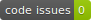

# {{ cookiecutter.toolbox_name }}

[](https://github.com/{{ cookiecutter.repo_owner }}/{{ cookiecutter.repo_name }}/releases/latest)

[]({{cookiecutter.fex_url}})

[](https://github.com/{{ cookiecutter.repo_owner }}/{{ cookiecutter.repo_name }}/actions/workflows/test-code.yml)

[](https://codecov.io/gh/{{ cookiecutter.repo_owner }}/{{ cookiecutter.repo_name }})

[](https://github.com/{{ cookiecutter.repo_owner }}/{{ cookiecutter.repo_name }}/security/code-scanning)
[](https://github.com/{{ cookiecutter.repo_owner }}/{{ cookiecutter.repo_name }}/actions/workflows/run-codespell.yml)
[](https://gitHub.com/{{ cookiecutter.repo_owner }}/{{ cookiecutter.repo_name }}/graphs/commit-activity)

{{ cookiecutter.toolbox_summary }}

## Description

{{ cookiecutter.toolbox_description }}

## Requirements and installation
It is recommended to use **MATLAB {{ cookiecutter.matlab_version_min }}** or later. 


The following MathWorks products are required:


- {{ product }}




The toolbox can be installed from MATLAB's [Add-On Explorer](https://se.mathworks.com/help/matlab/matlab_env/get-add-ons.html) (recommended). It is also possible to download the MATLAB toolbox from [FileExchange]({{cookiecutter.fex_url}}) or from the [Releases](https://github.com/{{ cookiecutter.repo_owner }}/{{ cookiecutter.repo_name }}/releases/latest) page of this repository and install it manually.


Users or developers who clone the repository using git can use [MatBox](https://github.com/ehennestad/MatBox) to quickly install this project's [requirements](./requirements.txt) (if any):

```matlab
{{cookiecutter.namespace_name}}tools.installMatBox() % If MatBox is not installed
matbox.installRequirements(path/to/toolboxRootDir)
```

## Getting started

```matlab
< add some code examples here >
```

## Contributing
Please see the [Contributing guidelines](.github/CONTRIBUTING.md) and the [Developer notes](.github/DeveloperNotes.md)

## License

This project is available under the {{ cookiecutter.license }} License. See the LICENSE file for details.

## Author

{{ cookiecutter.author_name }} ({{ cookiecutter.author_email }})
{{ cookiecutter.author_company }}
