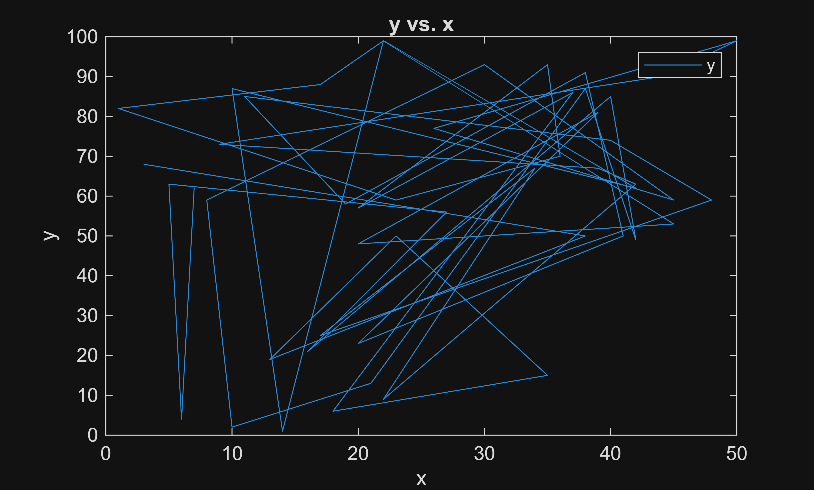

# Test Script for Converting Live Script to Markdown format

This is a test live script, seeing if I can convert the live script into markdown (.md) format. the goal is to work out examples in MATLAB livescript which then is converted to markdown and available for review in github and other sources

```matlab
%Here is some silly code
x = randi(50,[50 1]);
y = randi(100,[50 1]);

result = x + y
```

```matlabTextOutput
result = 50x1
    71
    88
    32
    73
    50
    24
   123
    77
   128
   106
    82
    83
   105
   121
    15

```

# Testing the use of controls in live script, and how they translate in an .md file

MATLAB has these control features that can be added into live scripts. They might be useful for interactive examples and modifications, but it is unclear how the format will translate to the .md file. 

```matlab
%Test out the addition of controls
%this checkbox will simply rerun the livescript when clicked
selection = true
```

```matlabTextOutput
selection = logical
   1

```

```matlab
%Lets try another. The color picker
color = [0.522 0.086 0.820]
```

```matlabTextOutput
color = 1x3
    0.5220    0.0860    0.8200

```


Conclusion: Live code control tools simply do not show up in any markdown, html, or notebook format.

# Trying out the live coder tasks

MATLAB has some preformatted coding operations to implement. let's see how these look.

```matlab
% Create plot of x and y
h = plot(x,y,"DisplayName","y");

% Add xlabel, ylabel, title, and legend
xlabel("x")
ylabel("y")
title("y vs. x")
legend
```



**Conclusion**: The live script editor is a viable choice for producing example scripts for AIDIF initiatives, as the new .m file is readable in git and can be converted into several formats like markdown to make the examples easier to reference.


&nbsp;&nbsp;&nbsp;&nbsp; The live scripts must be executed in order to run and present their results in the markdown file. There are MATLAB controls and tasks unique to the live script that makes the examples more interactive or easier to produce common actions. These features are hidden completely from view when converted into another document type.

